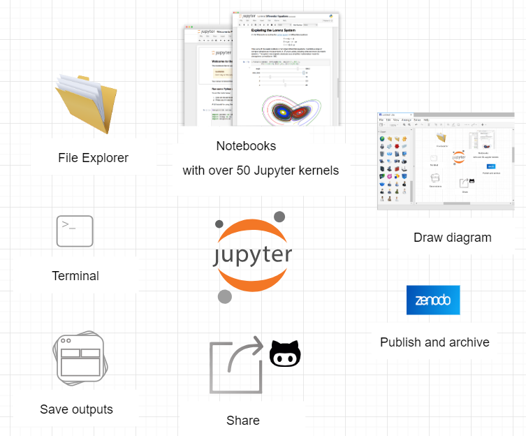
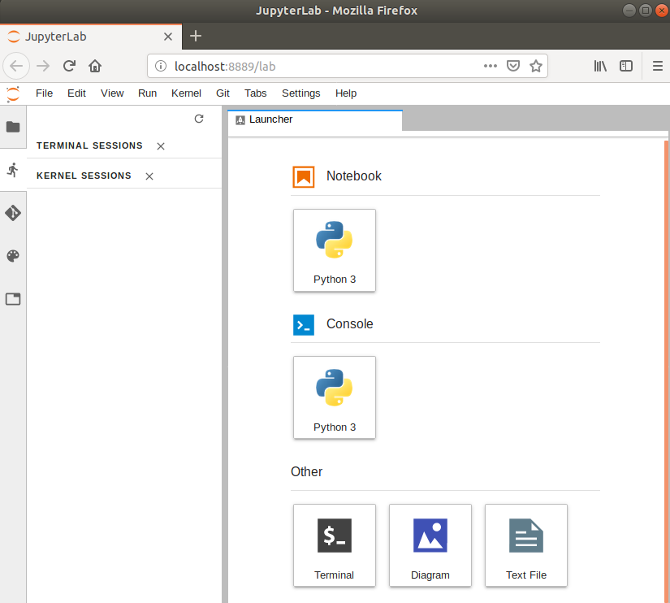

# What is Jupyterlab?

[JupyterLab](https://jupyterlab.readthedocs.io/en/stable/getting_started/overview.html) is the next-generation web-based user 
interface for [Project Jupyter](https://jupyter.org/). It is made of modular building blocks:
- File explorer
- Text editor
- Diagram generator
- jupyter notebooks supporting more than 50 different Jupyter kernels
- Terminals
- Outputs

with an easy integration with Jupyterlab extension such as [**jupyterlab-latex**](https://github.com/jupyterlab/jupyterlab-latex) 
for live-editing of LaTeX documents,  [**jupyterlab-git**](https://github.com/jupyterlab/jupyterlab-git) for git integration or 
[**jupyterlab-drawio**](https://github.com/QuantStack/jupyterlab-drawio) for creating diagrams.

See [JupyterLab slides](https://github.com/jupyterlab/jupyterlab-demo/blob/master/slides/jupyterlab-slides.pdf) from
[JupyterLab Github demo repository](https://github.com/jupyterlab/jupyterlab-demo) for more information about JupyterLab.
# Get familiar with Jupyterlab

Follow [setup instructions](../setup.html) and start `jupyterlab` from `anaconda-navigator`:

> ## Create a new python 3 jupyter notebook
> 
> - Create a new python 3 jupyter notebook
>
> ~~~
> from skimage import io
> import matplotlib.pyplot as plt
> %matplotlib inline
>
> # https://directory.eoportal.org/web/eoportal/satellite-missions/c-missions/copernicus-sentinel-2
> url="https://directory.eoportal.org/documents/163813/4091221/Sentinel2_Auto98.jpeg"
> image = io.imread(url)
> plt.imshow(image)
> plt.title("Peruvian mountain scene, 14 July 2017, Sentinel-2\n (credit: ESA, processed by ESA, CC BY-SA 3.0 IGO)")
> plt.show()
> ~~~
> {: .language-python}
>
> - Rename your notebook (give a meaningful name)
> - Add a markdown cell
>
> ~~~
> # Using equation with LaTeX notation in a markdown cell
> 
> The well known Pythagorean theorem $x^2 + y^2 = z^2$ was 
> proved to be invalid for other exponents. 
> Meaning the next equation has no integer solutions:
> 
> \begin{equation}
>  x^n + y^n = z^n 
> \end{equation}
> ~~~
> {: .language-python}
> 
> - Add a simple plot (see [matplotlib gallery for examples](https://matplotlib.org/gallery.html))
>
> ~~~ 
>import matplotlib
> import matplotlib.pyplot as plt
> import numpy as np
>
> # Data for plotting
> t = np.arange(0.0, 2.0, 0.01)
> s = 1 + np.sin(2 * np.pi * t)
> 
> fig, ax = plt.subplots()
> ax.plot(t, s)
> 
> ax.set(xlabel='time (s)', ylabel='voltage (mV)',
>        title='About as simple as it gets, folks')
> ax.grid()
> 
> fig.savefig("test.png")
> plt.show()
> ~~~
> {: .language-python}
>
> *Example above is taken from [https://matplotlib.org/gallery/lines_bars_and_markers/simple_plot.html](https://matplotlib.org/gallery/lines_bars_and_markers/simple_plot.html))*.
>
> You can also add your own notebooks and try them out. Please note that some python packages may not be available in the provided
> environment. 
>
> You can get the list of available packages with the following command:
> ~~~
> !conda list
> ~~~
> {: .language-python}
>
{: .challenge}



