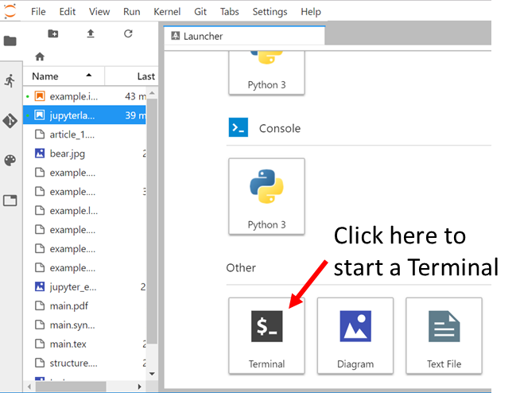
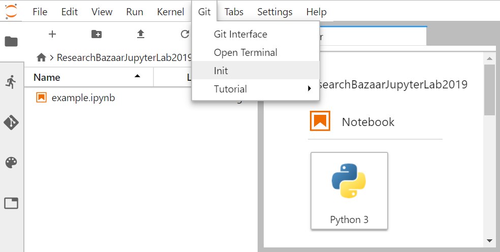
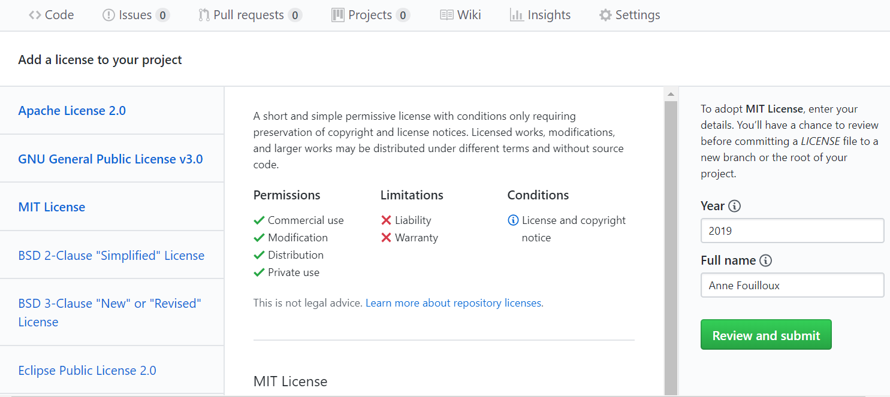

[JupyterLab git extension](https://github.com/jupyterlab/jupyterlab-git) is already installed in the Resbaz VM. If you want to
install this extension to your local JupyterLab, follow installation instructions at 
[https://github.com/jupyterlab/jupyterlab-git](https://github.com/jupyterlab/jupyterlab-git).

# Check availability of JupyterLab git extension

A tab labeled "Git" as well as "Git panel" are available once JupyterLab git extension is properly installed, as shown on the figure
below:

# Git setup

This section is taken from the [Software Carpentry Git lesson](http://swcarpentry.github.io/git-novice/02-setup/index.html). 
It has be shortened as we are using a Linux VM but feel free to go through the [entire Software Carpentry lesson](http://swcarpentry.github.io/git-novice)
if you need to install and use git on your laptop. 

When we use Git on a new computer for the first time,
we need to configure a few things. Below are a few examples
of configurations we will set as we get started with Git:

*   our name and email address,
*   what our preferred text editor is,
*   and that we want to use these settings globally (i.e. for every project).

Save and close your Jupyter notebook so you can start a terminal from the JupyterLab Launcher:

> ## Tips
> 
> - Another way to open a Git Terminal is to use the "Git" Tab -> "Open Terminal"
> - The copy/paste menu is "hidden" so to get it:
>      * *copy*: select the text to copy with your mouse then `SHIFT` and right-click with your mouse so the copy menu will appear.
>      * *paste*: `SHIFT` and right click to get the paste menu.
> 
{: .callout}

On a command line, Git commands are written as `git verb options`,
where `verb` is what we actually want to do and `options` is additional optional information which may be needed for the `verb`. So here is how
Dracula sets up his new laptop:

~~~
$ git config --global user.name "Vlad Dracula"
$ git config --global user.email "vlad@tran.sylvan.ia"
~~~
{: .language-bash}

**Please use your own name and email address instead of Dracula's**. This user name and email will be associated with your subsequent Git activity,
which means that any changes pushed to
[GitHub](https://github.com/),
[BitBucket](https://bitbucket.org/),
[GitLab](https://gitlab.com/) or
another Git host server
in a later lesson will include this information.

> ## Line Endings
>
> As with other keys, when you hit <kbd>Return</kbd> on your keyboard,
> your computer encodes this input as a character.
> Different operating systems use different character(s) to represent the end of a line.
> (You may also hear these referred to as newlines or line breaks.)
> Because Git uses these characters to compare files,
> it may cause unexpected issues when editing a file on different machines. 
> Though it is beyond the scope of this lesson, you can read more about this issue 
> [on this GitHub page](https://help.github.com/articles/dealing-with-line-endings/).
{: .callout}
>
> You can change the way Git recognizes and encodes line endings
> using the `core.autocrlf` command to `git config`.
> The following settings are recommended:
>
> On macOS and Linux:
>
> ~~~
> $ git config --global core.autocrlf input
> ~~~
> {: .language-bash}
>

**For these lessons, we will be interacting with [GitHub](https://github.com/) and so the email address used should be the same as 
the one used when setting up your GitHub account.** 
If you are concerned about privacy, please review 
[GitHub's instructions for keeping your email address private](https://help.github.com/articles/setting-your-commit-email-address-on-github/). 

If you select to use a private email address with GitHub, then use that same email address for the `user.email` value, e.g. `username@users.noreply.github.com` replacing `username` with your GitHub one. You can change the email address later on by using the `git config` command again.

The commands we just ran above only need to be run once: the flag `--global` tells Git
to use the settings for every project, in your user account, on this computer.

You can check your settings at any time:

~~~
$ git config --list
~~~
{: .language-bash}

You can change your configuration as many times as you want.

# Manage your research project with JupyterLab and Git/Github

To make publication ready scientific reports and presentations, we would need 
to share our research with [Github](https://github.com/).

In this section we will learn:

- How to create a new project repository on JupyterLab. A repository is a central location where source code and data is stored and managed
- How to add a file to the repository using JupyterLab git interface
- How to create a remote Github repository and push your local git repository to share it. 
- How to visually confirm that files have been added to the repository and preview files using the GitHub interface

Later in this workshop, we will see how to publish our research work using [MyBinder](https://mybinder.org/) and 
[Zenodo](https://zenodo.org/).

## Create a new local git repository

### Create a new folder 

- Click on the "Folder" icon to create a new Folder and rename it using a "meaningful name"; for instance `ResearchBazaarJupyterLab2019`.

- Move all the files/data you wish to belong to this repository 
(you can use your mouse and move files in the Folder or use the command line in a Terminal).

For our example, we will be moving the jupyter notebook we created (called `example.ipynb`).

- Double click on this new folder to enter it. For now it contains a unique file called `example.ipynb`.

### Create a new Git repository

As you are in the `ResearchBazaarJupyterLab2019` repository, click on the `Git Tab` and select `Init`. 

A window will pop-up, aksing for confirmation. Select **YES**.

It does not look like anything happened but you have now created a new git repository. Let's now add our research work to this 
repository.

### Add your research work in your newly created repository

On the left hand side of the JupyterLab panel, click on the "Git Icon" as shown on the figure below:

If you are familiar with Git, you will recognize the interface and steps we use for staging and committing files into git.

- Click on the "small arrow sign" to track `example.ipynb` as shown on the figure above.
- In a Text box, add an **Input message to commit staged changes**; for instance "Simple Python notebooks developed during Research Bazaar 2019"
- Then commit by click on the "commit" sign as shown in the figure below:

You are done! However, make sure you stage and commit your notebooks and related research work every time you make changes and are willing to keep
track of these changes!

# Share your research work online using Github

In anticipation of our next lesson on sharing using the capability of [Binder](https://mybinder.org), 
we need to share the notebook that we have been working on.

One step consists in sharing your local git repository on Github. For this, you would need a [Github](https://github.com/) account.

## GitHub

GitHub is a development platform where we "_can host and review code, manage projects, and build software._" GitHub hosts source code 
for 75+ million projects including the `pandas` package we have been using among many others.

Make sure you have a (free) account otherwise follow our [setup instructions](../setup.html#github-account).

### 1. Create a new repository

- Click on _Start a project_ as shown below.

> ## Create a new repository:
>
> - Add a repository name. We choose to name our repository `research-bazaar-jupyter-2019`.
> - Add a description, for instance: "Repository for the Research Bazaar workshop on publishing jupyter notebooks"
> - Personal GitHub accounts require that projects be _public_.
> - **DO NOT Check the _Initialize this repository with a README_ option**.
> - ** DO NOT add a _license_**. We will add it afterwards.
> - Click the green _Create repository_ button.
{: .challenge}

If everything went fine, you should be re-directed to a page giving you sime information on the next steps, as shown in the figure below:

**Congratulations!!** We now have created our repository for hosting our research work!

### 2. Link your local repository to your Github repository

As we already have a local repository, we will push our existing repository from the command line. Open a Terminal (Git tab --> Open Terminal):

~~~
git remote add origin https://github.com/annefou/research-bazaar-jupyter-2019.git
git push -u origin master
~~~
{: .language-python}

- **Make sure you change *annefou* by your github username!**.
- You will be asked to enter your github *username* and *password*.

### 3. Add a LICENSE 

Choosing a license may be tricky and is out of scope of this workshop. However, without a license, sharing our work is meaningless.

We will be adding an [MIT license](https://choosealicense.com/licenses/mit/) to our github repository. To get more information on which license to choose, follow this 
[link](https://choosealicense.com/).

- Go to [https://choosealicense.com/licenses/mit/](https://choosealicense.com/licenses/mit/) in your browser
- On the right hand side, enter your github repository address to "Suggest this license" panel

You will be re-directed to your Github repository `research-bazaar-jupyter-2019` and the current date and your name will be automatically
suggested. 
- Click on "Review and Submit"
- As you are now the only one working on this remote repository, you can safely choose to `Commit directly to the master branch` and then
click on "Commit new file".

> ## Tips
>
> If you choose to `Create a new branch for this commit and start a pull request`, follow the steps to start a pull request and
merge your contribution to the master branch.
>
{: .callout}

### 4. Add a README file

As suggested, add a README file from the Github interface.

### 5. Authoring & Citation

In addition to LICENSE, it is recommended to add:

- **AUTHORS**: file containing the list of contributors
- **CITATION**: file containing information on how to cite your work, including a DOI (Digital Object Identifier)

## List of authors

A GitHub repository is very often created by an individual user so adding the list of authors is very important.

> ## Add a new file AUTHORS in your repository
>
> - Go to your repository in your web browser
> - Click on "Create new file" and name your file `AUTHORS`
> - Add the list of authors/contributors and commit your changes
>
{: .challenge}
 
 

# Sync your local git repository

We have done a number of changes to our Github repository but if you go back to your jupyterLab instance, you will see that none 
of them are reported yet. 

To synchronize your local git repository, go back to your Jupyterlab:

> ##Tips
>
> You can also pull from a Git Terminal; make sure you are in the `ResearchBazaarJupyterLab2019` repository.
> 
> ~~~
> pwd
> ~~~
> {: .language-bash}
> 
> ~~~
> /home/resbaz/ResearchBazaarJupyterLab2019
> ~~~
> {: .output}
> 
> And then pull the remote changes:
> 
> ~~~
> git pull 
> ~~~
> {: .language-bash}

 
> ## Where to find more about GitHub
> To learn more about GitHub you can review one or more of these additional (external) resources:
> - GitHub Guide - [Hello World](https://guides.github.com/activities/hello-world/)
> - All the [GitHub guides](https://guides.github.com)
> - Hubspot [`git` and GitHub tutorial](https://product.hubspot.com/blog/git-and-github-tutorial-for-beginners)
> - Plurlsight's [GitHub beginner's guide](https://www.pluralsight.com/blog/software-development/github-tutorial)
> - Code School's [GitHub tutorial](https://www.codeschool.com/courses/mastering-github)
{: .discussion}

> ## More about Git version control
> If you would like to learn about source code version control using the `git` software, the `git` in GitHub, please see these resources:
> - Try this 15 minute interactive  [`git` tutorial](https://try.github.io/)
> - Try some additional `git` exercises [here](https://gitexercises.fracz.com)
{: .discussion}



