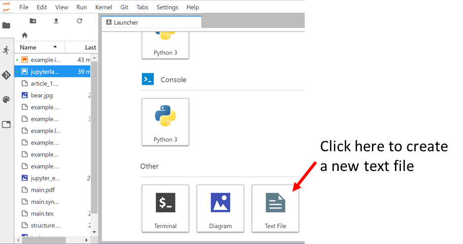
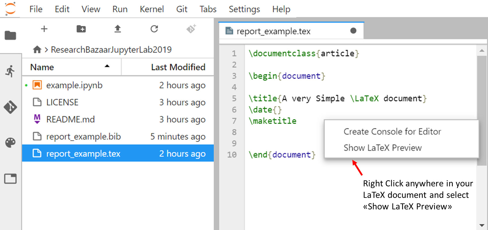
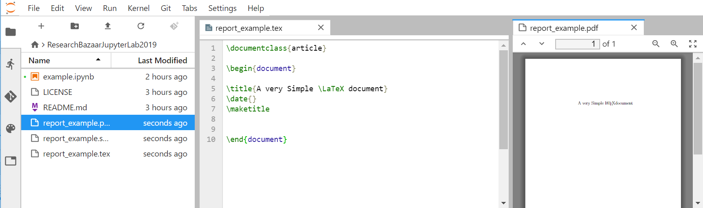
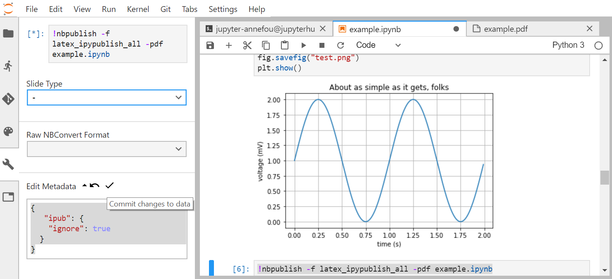

We have been using JupyterLab to keep our research work and are now ready to write a scientific paper 
associated with our computing results and for writing our paper, we will be using [LaTeX](https://www.latex-project.org/).

# JupyterLab extension for live editing of LaTeX documents

The [JupyterLab LaTeX](https://github.com/jupyterlab/jupyterlab-latex) extension has already been installed in the VM. In case, you need
to set it up on your laptop, follow instructions given [here](https://github.com/jupyterlab/jupyterlab-latex/blob/master/README.md).

## Create a new LaTeX document

- Create a new empty file

- Rename it to `report_example.tex`

- Then we will create a very simple LaTeX document and check it out with the JupyterLab:

~~~
\documentclass{article}

\begin{document}

\title{A very Simple \LaTeX document}
\date{}
\maketitle

\end{document}
~~~
{: .language-latex}

- Save it and then right click to select "Show LaTeX preview" as shown in the figure below:

The `pdf` preview of your document will appear on the right hand side of JupyterLab:

> ## Update your LaTeX document
>
> Add new sections in your LaTeX document. What happens?
>  
> > ## Solution
> > 
> > The pdf document is automatically updated!
> {: .solution}
{: .challenge}

> ## Add a bibliography (BibTeX)
>
> Create a new bibtex file with at least one reference and reference it in `report_example.tex`
>  
> > ## Solution
> > 
> > In `report_example.bib`:
> >
> > ~~~
> > @article{einstein,
> >     author =       "Albert Einstein",
> >     title =        "{Zur Elektrodynamik bewegter K{\"o}rper}. ({German})
> >         [{On} the electrodynamics of moving bodies]",
> >     journal =      "Annalen der Physik",
> >     volume =       "322",
> >     number =       "10",
> >     pages =        "891--921",
> >     year =         "1905",
> >     DOI =          "http://dx.doi.org/10.1002/andp.19053221004"
> > }
> > ~~~
> > {: .language-bash}
> >
> > And in `report_example.tex`:
> > 
> > ~~~
> > \documentclass{article}
> > 
> > \begin{document}
> > 
> > \title{A very Simple \LaTeX document}
> > \date{}
> > \maketitle
> > 
> > \section{introduction}
> > 
> > This document shows how to use BibTeX references. 
> > 
> > To cite the Einstein journal paper use \cite{einstein}.
> > 
> > \medskip
> >  
> > \bibliographystyle{unsrt}
> > \bibliography{report_example}
> > 
> > \end{document}
> > 
> > ~~~
> > {: .language-bash}
> >
> {: .solution}
> See [https://fr.overleaf.com/learn/latex/Bibliography_management_with_bibtex](https://fr.overleaf.com/learn/latex/Bibliography_management_with_bibtex)
> to get more examples.
{: .challenge}

# Generate LaTeX from our jupyter notebooks

Being able to create LaTeX live documents with JupyterLab is great but we also need to make use of our jupyter notebooks so we can 
create a reproducible research work, share it and publish it.

Let's go back to our jupyter notebook example and let's create a nice LaTeX document from it.

- Close `report_example.tex` and `report_example.pdf` and open `example.ipynb`.
- Add a new code cell at the end with the following information:

~~~
!nbpublish -f latex_ipypublish_all -pdf example.ipynb
~~~
{: .language-python}
 
 - Execute this cell and check `converted` directory. It should contain a list of files and in particular:
      * _example.tex_
	  * _example.pdf_

`nbpublish` can be called directly from your jupyter notebook or from the jupyterLab Terminal.

## Cell inspector

It is sometimes convenient to inspect and modify metadata of a given cell. For instance, to ignore the cell where nbpublish is run:

~~~
{ 
   "ipub": {
    "ignore": true
  }
}
~~~
{: .language-bash}

Add it in the metadata of the corresponding cell, as shown in the image below:

Do not forget to *commit changes to data*.

There are several options (not only latex_ipypublish_all) to generate and customize what you would like to see in your report. 

Check the [ipypublish documentation](https://ipypublish.readthedocs.io/en/latest/) for more information. Please note that
the `ipypublish` python package is still under development (beta version avaiable only).

> ## Add generated files into your Github repository
> 
> Add the updated example.ipynb, example.pdf, report_example.tex, report_example.bib and report_example.pdf to your Github
> repository `research-bazaar-jupyter-2019` using JupyterLab git extension and/or JupyterLab Git Terminal. 
> 
{: .challenge}

## Additional ipypublish example

In this short tutorial, all the functionalities of ipypublish are not demonstrated. However, feel free to browse the [following example](https://github.com/annefou/ipypublish_example).

# Combine our Jupyter notebooks and LaTeX documents 

Now we can combine our jupyter notebook and our LaTeX document to generate a single publication ready scientific report.

A very simple way to combine them is to merge the pdf generated files. Create a new text file and rename it `report_main.tex`:

~~~
\documentclass{report}
\usepackage{pdfpages}
\usepackage{fancyhdr}
\fancyhf{}
\renewcommand{\headrulewidth}{0pt}
\pagestyle{fancy}
\rfoot{\thepage}
\begin{document}
\tableofcontents
\chapter{A chapter}
\section{Introduction}
\includepdf[pages=1-,pagecommand={\thispagestyle{fancy}}]{report_example.pdf}
\includepdf[pages=1-,pagecommand={\thispagestyle{fancy}}]{example.pdf}
 
 
\end{document}
~~~
{: .language-latex}

Then generate the resulting pdf files ("Show LaTeX preview"). 

> ## Add generated files into your Github repository
> 
> As before, add report_main.tex and report_main.pdf to your Github
> repository `research-bazaar-jupyter-2019` using JupyterLab git extension and/or JupyterLab Git Terminal. 
> 
{: .challenge}
	  
	  


