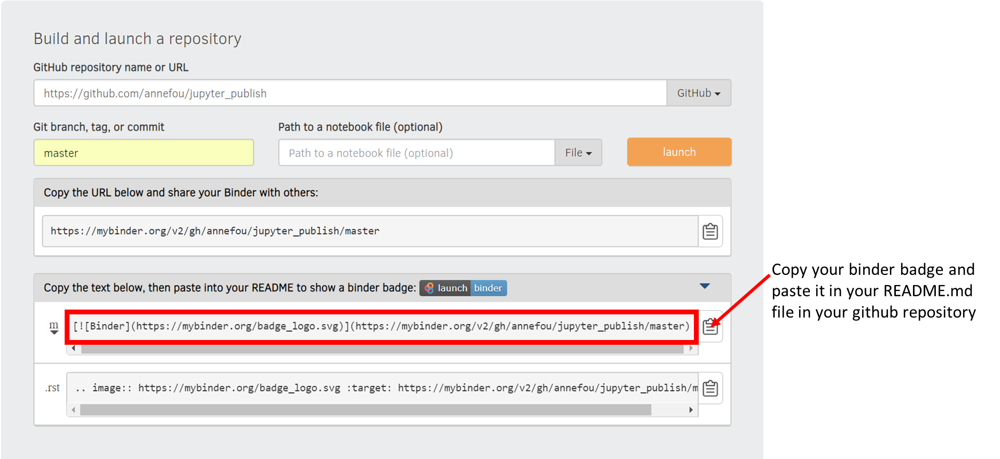
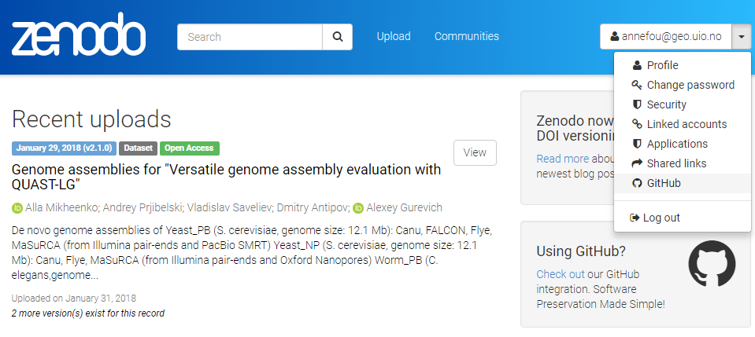

# MyBinder reproducible environment

Sharing your GitHub repository along with your jupyter notebooks and your LaTeX publications is an important step for making your 
research reproducible. However, anyone willing to rerun your programs/notebooks need to get the same computational environment 
(python, LaTeX, additional python packages, etc.).

The next section (using [Binder](https://github.com/jupyterhub/binderhub")) will show you how to make your research "fully" 
reproducible, offering users the same computational environment as we used during this workshop and with very little extra efforts.

> ## Important notice
> This lesson has been taken from [https://reproducible-science-curriculum.github.io/sharing-RR-Jupyter/](https://reproducible-science-curriculum.github.io/sharing-RR-Jupyter/)
> and is distributed under the <a href="https://creativecommons.org/licenses/by/4.0/">Creative Commons Attribution license</a>.
> The following is a human-readable summary of (and not a substitute for) the <a href="https://creativecommons.org/licenses/by/4.0/legalcode">full legal text of the CC BY 4.0 license</a>.
{: .callout}

# Reproducible computing environments with Binder

## A short intro on Binder

Authors: Chris Holdgraf, M Pacer

[Slideshow](https://reproducible-science-curriculum.github.io/sharing-RR-Jupyter/slides/02-intro_to_binder.slides.html#/)

## Turn your github repository into a reproducible environment with [mybinder](https://mybinder.org/)

### Preparing your github repository for Binder

We would like to publish all the codes in our repository with Binder. To be Binder-compliant,
we need to add configurations files (one or more text files) that specify the requirements for building your project’s code:

#### Sharing our Python environment (environment.yml)

This approach is recommended when all the additional packages/libraries you need are part of conda. Be aware that `conda` is a source package management system and is not only used for `python`. Many packages/libraries, independent of python/R are made available via conda, so the best is to first check online whether your package is already available via conda.

~~~
name: resbaz
channels:
  - nordicesmhub
  - bioconda
  - conda-forge
  - defaults
dependencies:
  - python=3.6
  - numpy
  - xarray
  - cartopy
  - matplotlib
  - netcdf4
  - geopandas
  - tqdm
  - rasterio
  - pandoc
  - html5lib
  - ipython_genutils
  - ipyvolume
  - ipywidgets
  - jupyter_latex_envs
  - jupyter_contrib_nbextensions
  - nbconvert
  - nbformat
  - jupyterlab
  - nodejs
  - scikit-image
  - ipypublish
  - pip:
      - jupyterlab_latex
      - jupyterlab-git
~~~
{: .language-bash}

This file must be placed in the root directory of your reprository on Gitub.

#### Sharing our complete workflow

Using environment.yml, we can run jupyter notebooks except if additional system libraries are required. In addition, we cannot run LaTeX as
it is not available by default.
To share our computational environment, additional system packages (LaTeX, etc.) need to be installed.

These packages are not available as a `conda` package but we can install them with `apt-get install`.

- apt.txt : contains all the debian packages that should be installed for installing and compiling LaTeX documents.

~~~
texlive-latex-base
texlive-latex-recommended
texlive-science
texlive-latex-extra
texlive-fonts-recommended
dvipng
ghostscript
latexmk
texlive
vim
~~~
{: .language-bash}

- environment.yml (same as before i.e. with all the conda packages we need)

- postBuild

~~~
#!/bin/bash

pip install jupyterlab_latex

jupyter serverextension enable --sys-prefix jupyterlab_latex

jupyter labextension install @jupyterlab/jupyterlab-drawio jupyterlab/latex jupyterlab/git

jupyter labextension install @jupyter-widgets/jupyterlab-manager
jupyter serverextension enable --py jupyterlab_git

~~~
{: .language-bash}

> ## Note
> This file must be executable to be used with repo2docker.
> To do this, run the following on Linux/Mac-OSX:
> ~~~
> chmod +x postBuild
> ~~~
> {: .language-python}
>
> On Windows (to be done before you commit your file):
> ~~~
> git update-index --chmod=+x postBuild
> ~~~
> {: .language-python}
{: .callout}

> ## Launch your computational environment on Binder
>
> - Start your complete computational environment on <a href="https://mybinder.org/">Binder</a>
> - Try to execute your notebook
> - Check your notebook can run in your Binder environment
{: .challenge}

### Get a shareable Binder Badge

- Create a shareable Binder link

- Update your README file in your github repository to display the shareable Binder badge

# Make your github repository citable with Zenodo

## Make your GitHub repository citable (<a href="https://en.wikipedia.org/wiki/Digital_object_identifier#">DOI</a>)

Your GitHub repository contains your scientific workflow, your programs/software, datasets (or links to your datasets) and jupyter dashboards so it is important to make the work you share on GitHub citable by archiving your GitHub repository to get a DOI. You may have a Data archive in your University or you may use the data archiving tool <a href="https://zenodo.org/">Zenodo</a>.

### Login to Zenodo

- Go to <a href="https://zenodo.org/">https://zenodo.org/</a> and click on `Log in` (not `Sign up`)
- Choose `Log in with GitHub`

- Zenodo will redirect you back to GitHub and ask you to give Zenodo the permissions it needs. click `Authorize Application`:

**Source**: <a href="https://guides.github.com/activities/citable-code/zenodo-authorize.png">https://guides.github.com/activities/citable-code/zenodo-authorize.png</a>

### Get a DOI for your Github repository

- When sucessfully login to Zenodo, click on your username (top right) and select `GitHub`

Then
- Select the repository `research-bazaar-jupyter-2019` and flip the switch to `on`
- Create a <a href="https://help.github.com/articles/creating-releases/">Release on Github</a>
- Then go to your GitHub repository and click on `settings` and select `Webhooks`

Your GitHub repository is now linked to Zenodo and you will automatically get a DOI:

### Add your DOI to your GitHub repository

- Get your DOI badge on Zenodo and copy your DOI information (selection markdown)

- Go to your GitHub repository and edit your README file to add your DOI
- Create a new file CITATION in your GitHub repository and show how to cite your reprository with your DOI
 



