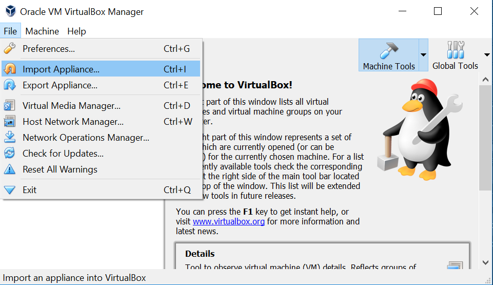
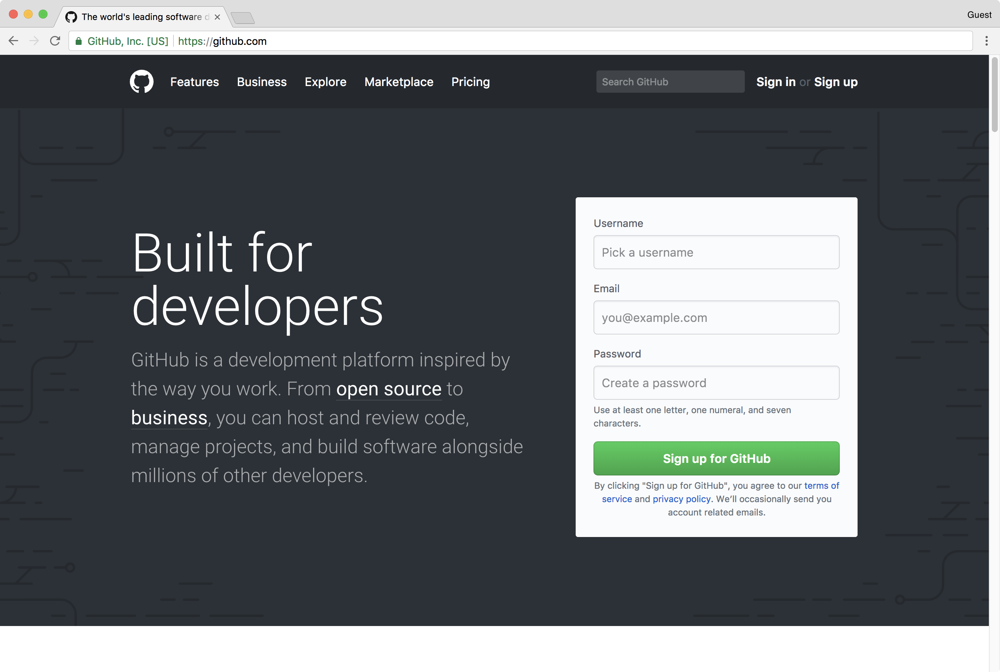
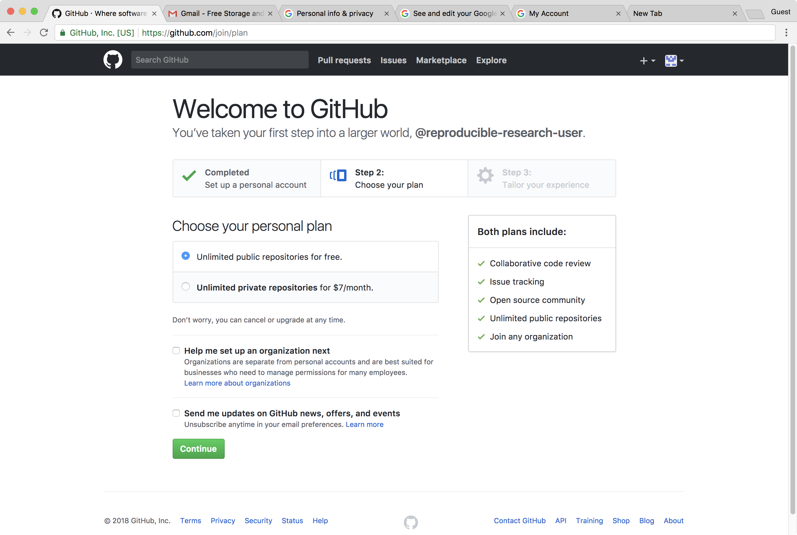

**We strongly recommend using a virtual machine for the hands-on parts of 
the workshop.**

A virtual machine, or VM, enables you to run a different operating system on your computer, from within your existing operating 
system. For these workshop we will use a VM image to run a fully configured Linux instance on participants' laptops. 
This will allow you to switch between your native/host operating system (Windows, Mac OS, Linux) and the guest Jupyterlab Linux 
operating system.

Using a virtual machine ensures that you will be running with the same configuration as the instructor. It also relieves you 
from having to setup your jupyterlab instance and installing prerequisites. With the Resbaz jupyterlab provided VMs you will
also receive support from the instructors and you fellow attendees. 

# Getting ready for the workshop

Make sure the following steps are done before the workshop. These steps take some time, and require downloading large files, 
so please do not postpone this until you arrive. Contact us (organizers@swcarpentry.uio.no) before the workshop if you have 
any problems.

1. **Install VirtualBox on your laptop**

Download and install the VirtualBox package from this [link](https://www.virtualbox.org/wiki/Downloads).

You can install the latest version or at least version VirtualBox 5.2.

2. **Install the needed VM on your laptop**

You will want to download this VM before arriving at the workshop, 
because it is a large file and it will take too much time to download over the wifi network.

- Download Resbaz Jupyterlab VM [OVA file](https://zenodo.org/record/2530356/files/resbaz2019.ova?download=1) (12.6GB)

This VM contains:

- [Anaconda with python 3.7](https://www.anaconda.com/download/)
- [TexLive 2018](https://www.tug.org/texlive/acquire-netinstall.html)
- [`resbaz` conda environment](https://raw.githubusercontent.com/annefou/jupyter_publish/master/environment.yml) with Jupyterlab 
  and other python packages we will be using for the workshop.

Please note that for the workshop, we will be using python 3.6 from `resbaz` environment. Everything has already been set up in the VM.

This section will include directions on how to start up, access, and use these virtual machines on your laptop.

### Import the VM into VirtualBox

First, make a backup copy of the downloaded .ova file(s). If something goes wrong you can always make a new copy.

Import the VM image into VirtualBox by either starting the downloaded .ova file directly, or by launching VirtualBox and 
navigating to File → Import Appliance and opening the file.

This will display the Appliance Import Settings window. Click the Import button.
It may then take several minutes for VirtualBox to import the VM. Once it is done, a new VM will appear in the left pane in 
the 'powered off' state.
The VM is now installed.

### Start VM 

- Double-click on the new VM in the left panel of VirtualBox. This starts the VM and displays two informational messages about 
regaining control of your keyboard and mouse from the VM. **Click OK for both**.
A screen showing the defined user on this machine is shown. Click on the *resbaz* user and then enter the password (*123456789*).

- This will log you in and show the ubuntu desktop.

### Start jupyterlab

- Open a terminal

~~~
anaconda-navigator
~~~
{: .language-bash}

You should get the `anaconda-navigator` as shown on the figure below:

- Then select `resbaz` environment:

- Then launch `jupyterlab`

You are done! 

> ## Troubleshooting
>
> If VirtualBox is only showing 32-bit versions in the Version list make sure:
>
> - You have an x64 CPU installed. (Optimally, a 64-bit OS should also be installed to receive acceptable virtualization performance.)
> - Hardware virtualization is enabled in the BIOS. (Your CPU must support it.)
>      * For Intel x64: VT-x (Intel Virtualization Technology) and VT-d are both enabled
>      * For AMD x64: AMD SVM (Secure Virtual Machine) is enabled
> - Hyper-V (or any other form of bare-metal hypervisor) is not installed 
>
> For more information follow [this link](https://www.tactig.com/enable-intel-vt-x-amd-virtualization-pc-vmware-virtualbox/).
>
{: .callout}

# Github Account

### Go to the GitHub Homepage

> ## Important notice
> This setup instruction are from [https://reproducible-science-curriculum.github.io/sharing-RR-Jupyter/](https://reproducible-science-curriculum.github.io/sharing-RR-Jupyter/)
> and is distributed under the <a href="https://creativecommons.org/licenses/by/4.0/">Creative Commons Attribution license</a>.
> The following is a human-readable summary of (and not a substitute for) the <a href="https://creativecommons.org/licenses/by/4.0/legalcode">full legal text of the CC BY 4.0 license</a>.
{: .callout}

To use GitHub one needs to register for a (free) account. To register for a GitHub account we need to:

1. Open a web browser
2. Navigate to [github.com](https://github.com)

We should see the the web page below.

**Note**: _If you already have a GitHub account you do __NOT__ need to create a new one. Please skip this step._

### To create a GitHub account

- On the GitHub homepage enter:

    - a username
    - an email address
    - a password

- Click the green _Sign up for GitHub_ button.

An example is shown in the screenshot below.

We are asked to confirm the email address that we used to sign. Please confirm the email address.

**Select a plan**

We have to choose a plan that we would like to use. We will use the personal (default) plan.

Click on _Continue_.

**Completing our signup**

We can select any options we would like (on none).

Click _Submit_ to complete our `Github` account setup.


